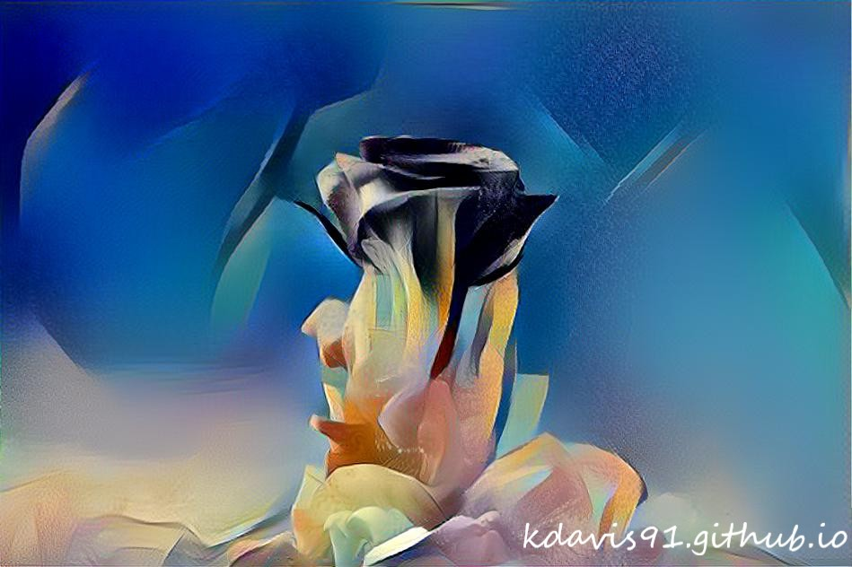
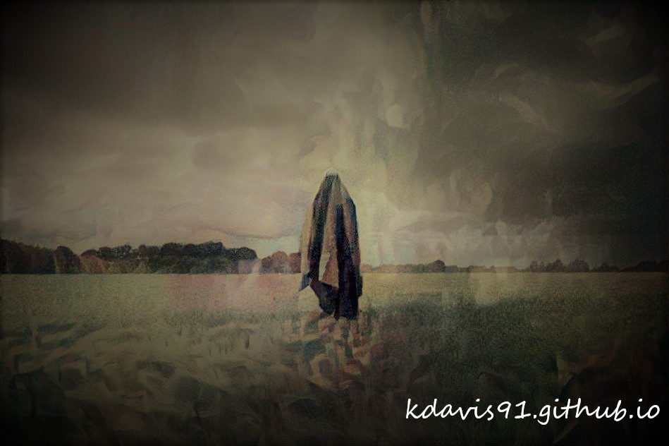

# Kyle Davis 

 

 

                               

### Data Science and Physics problems.

> "All models are wrong, but some are useful" [George Box](https://en.wikipedia.org/wiki/George_E._P._Box "https://en.wikipedia.org/wiki/George_E._P._Box") 

### Projects

My open source offerings.

>Neural painting

>Predicting UK House prices using ARIMA forecasting:                       

 
 
 
 
 
 
 
 
 
 
 
 
 
 
 

>Predicting Bitcoin price using K-means (source code to follow)

                       
                
