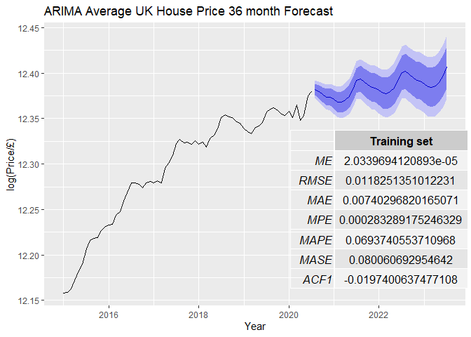

<!-- my-page.html --> 

### Data Science and Physics problems.

> "All models are wrong, but some are useful" [George Box](https://en.wikipedia.org/wiki/George_E._P._Box "https://en.wikipedia.org/wiki/George_E._P._Box") 

### Projects

My open source offerings.

                       Predicting UK House prices using ARIMA forecasting:

